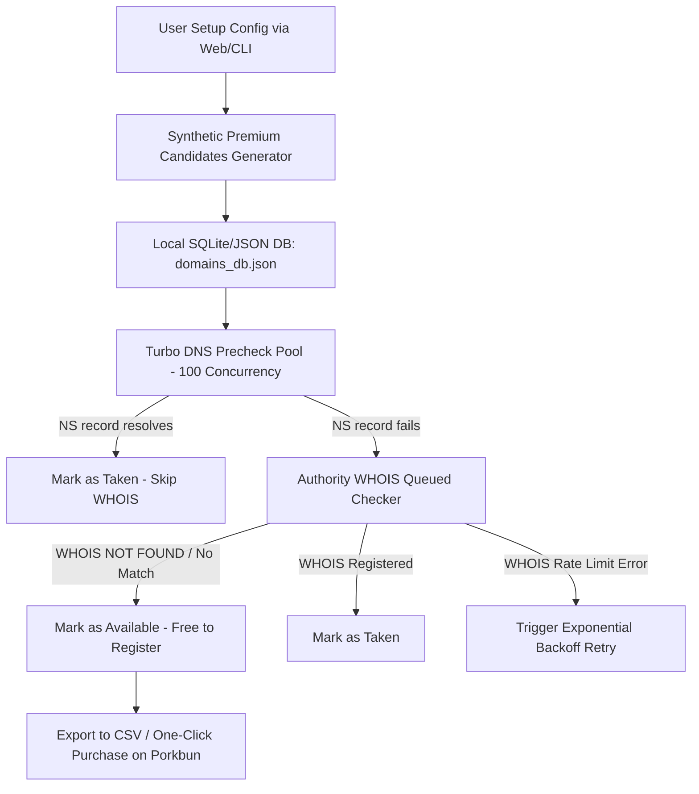

# 🌐 DIGITX - Premium Numerical Domain Finder & Turbo Validator

[](https://opensource.org/licenses/MIT)
[](https://nodejs.org/)
[](https://github.com/yourusername/digitx/pulls)

An ultra-premium, high-performance Node.js numerical domain generator, scorer, and real-time dual-stage scanner. It is designed to help you discover hidden, high-value, and un-registered pure-digit domains (.xyz, .com, .net, .org, .cc, or any custom suffix) by targeting developer-centric ciphers, aesthetic symmetrical structures, and traditional luck patterns.

> 🌐 **Chinese version of this documentation is available:** [简体中文说明文档](README.zh-CN.md)

---

## 📸 Project Interface Showcase
*Premium Glassmorphic Cyberpunk Desktop Dashboard & Live Interactive Terminal CLI*

* **Cyberpunk Obsidian Dashboard**: Beautiful neon highlights, real-time statistical monitors, dynamic search with Regular Expressions support, category tabs, and direct Porkbun registration links.
* **Interactive Terminal CLI**: Fully featured interactive CLI scanner with a spinner, percentage loader, safe pause-and-resume database sync, and formatted discovery cards.

---

## ✨ Key Product Features

### 🧠 1. Intelligent Scoring Engine (`generator.js`)
Instead of brute-forcing 100 million combinations, DIGITX uses a **synthetic pattern-generation strategy** to construct high-value sequences directly. It evaluates and scores each generated candidate out of 100:
* **Developer Favorites**: Captures ciphers like `1024` (Programmer's Day), `404` (Not Found), `12306` (China Railway API), `127001` (Loopback IP), `2048`, `996`, `955` etc.
* **Aesthetic Structures**: Matches `AAAAAA` (pure repeaters), `AAABBB` (triple stacks), `AAAABBBB` (rhythm pairs), `AABBCC`, and mirror palindromes (`abccba`, `abcddcba`).
* **Traditional Luck Pun Symbols**: Employs Chinese cultural wealth segments like `168` (Road to Wealth), `520` / `521` (I Love You), `1314` (Forever).
* **Smart "4" Excluder**: Intelligently strips out mundane numbers containing `4` while **fully preserving** programmer classics (e.g. `1024`, `404`).

### ⚡ 2. Double-Channel Anti-Redirection Scanner (`checker.js`)
Most local networks and proxy environments hijack unregistered domain `A-records`, causing false positives. DIGITX solves this through a dual-stage system:
* **Stage 1 (DNS Precheck)**: Queries **`NS` (Name Server) records** at massive concurrency (100 parallel requests) to instantly bypass sandbox ISP IP redirection. Resolving `NS` means the domain is 100% taken.
* **Stage 2 (WHOIS Verification)**: Runs deep, authoritative WHOIS lookups on the remaining candidates.
* **Auto-Backoff Retry**: Automatically performs exponential backoff retries when WHOIS queries are rate-limited, safely avoiding IP bans.

### 🎛️ 3. Full Custom TLD Suffix Customization
Not limited to `.xyz`! The system allows selecting common suffixes like `.com`, `.net`, `.org`, `.cc` or typing any custom suffix (such as `.top`, `.vip`, `.win`). The generator instantly updates and regenerates scores according to the target suffix.

### 📥 4. Chinese Character CSV Exporter (UTF-8 BOM Protected)
Download your discovered unregistered premium domains directly to a CSV file in one click. Features built-in `\ufeff` Byte Order Mark (BOM) protection, ensuring Chinese categories and description texts render perfectly without scrambled encoding inside Microsoft Excel.

---

## 🛠️ Architecture Workflow



---

## 🚀 Quick Start Guide

### 📦 1. Installation
Ensure you have [Node.js](https://nodejs.org/) installed (v16+ recommended).
Clone the repo and run standard installation:
```bash
git clone https://github.com/yourusername/digitx.git
cd digitx
npm install
```

### 💻 2. Run Interactive Console CLI
Perfect for quick, serverless scanning directly inside the terminal:
```bash
npm run cli
```
**CLI Interface Features:**
* Select target TLD suffix (.com, .xyz, or custom).
* Choose digit length combinations (6-digit, 7-digit, 8-digit).
* Exclude "4" switch & set value threshold.
* Real-time progress bar. **Press `CTRL+C` to safely pause** and save current scan states.

### 🖥️ 3. Run Cyberpunk Glassmorphic Web Dashboard
Start the local Express server and enjoy the premium Web UI:
```bash
npm start
```
* Access the control panel: [http://localhost:3000](http://localhost:3000)
* Synchronize configuration sliders, trigger lists regeneration, click **"Start Scanner"** to witness live turbo scanning logs, search domains using **Regular Expressions (Regex)**, and export available files.

---

## 📂 Project Structure

```text
├── LICENSE               # MIT License
├── README.md             # Default English Documentation
├── README.zh-CN.md       # Localized Chinese Documentation
├── checker.js            # NS DNS Resolver, WHOIS client queue & local storage migrator
├── cli.js                # Interactive inquirer CLI client
├── generator.js          # Core scoring and cipher-pattern algorithms
├── package.json          # Dependency specs (Express, Inquirer, Whoiser)
├── server.js             # Express API backend server
├── verify_feasibility.js # Concurrent dry-run verification script
└── public/               # Web Dashboard frontend static assets
    ├── index.html        # Main localized index UI
    ├── css/
    │   └── style.css     # Premium Cyberpunk Obsidian theme style sheets
    └── js/
        └── app.js        # High-performance grid rendering, dynamic tabs & exporter
```

---

## 🤝 Contributing
Contributions are extremely welcome! Feel free to submit an Issue or file a Pull Request if you'd like to help us add more premium domain patterns, TLD custom strategies, or UI translation features.

## 📄 License
This project is open-sourced under the terms of the **MIT License**. Check the [LICENSE](LICENSE) file for more information.
