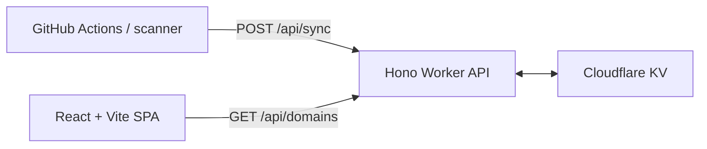

# DIGITX

DIGITX finds and validates high-value numeric domain candidates: repeaters, sequences, lucky numbers, technical constants, and more.

It is a pnpm TypeScript monorepo with a React interface, a Cloudflare Worker API backed by KV, and a throttled DNS/WHOIS scanner.

## Architecture



- `packages/core` — typed candidate generator, DNS/WHOIS checker, and database helpers.
- `apps/scanner` — interactive CLI and scheduled batch scanner.
- `apps/api` — Hono Cloudflare Worker with KV storage.
- `apps/web` — React, Vite, Tailwind, and shadcn/ui frontend.

## Prerequisites

- Node.js 20+
- pnpm 10+
- A Cloudflare KV namespace and Worker secrets for production sync

## Commands

```bash
pnpm install
pnpm check-types
pnpm build
```

Run the interactive local scanner:

```bash
pnpm cli
```

Run one scheduled scan batch and sync it to the API. Set `API_URL` and `SYNC_SECRET` first:

```bash
pnpm scan
```

Run the frontend or Worker locally:

```bash
pnpm dev:web
pnpm dev:api
```

`domains_db.json` is an ignored local checkpoint for the scanner. Cloudflare KV is the production source of truth.

## Safety

The scanner uses a two-stage process: a concurrent DNS filter followed by throttled WHOIS verification. Keep the default WHOIS delay (2000ms) to avoid rate limiting or registry IP bans.

## License

MIT
