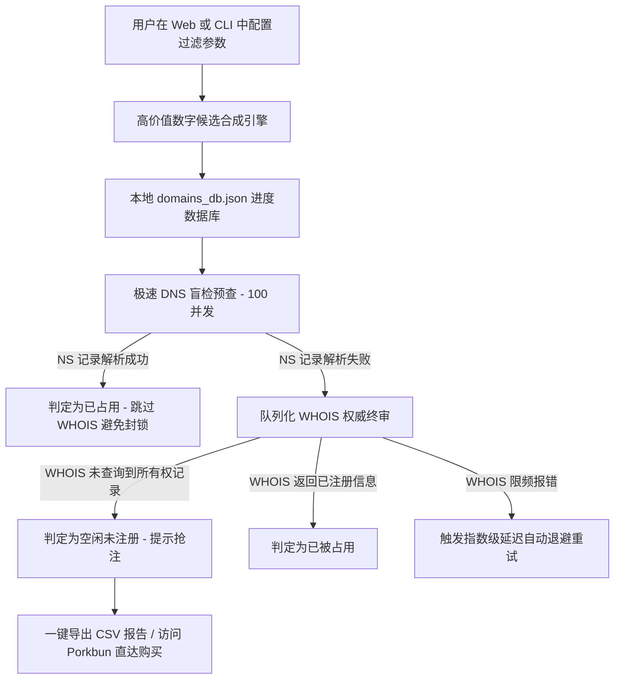

# 🌐 DIGITX - 极品纯数字域名发现工具 & 极速双通道扫描器

[](https://opensource.org/licenses/MIT)
[](https://nodejs.org/)
[](https://github.com/gaoxiaoduan/digitx/pulls)

这是一个专为寻找高价值纯数字域名设计的超强 Node.js 域名合成、评分及实时双通道检测工具。它可以帮助你从海量数字组合中，根据程序员专属暗号、对称镜像、国人吉祥发音等规律，极速找出那些被遗漏的极品未注册域名（支持 .xyz、.com、.net、.org、.cc 或任何自定义后缀）。

> 🌐 **English version of this documentation is available:** [English README](README.md)

---

## 📸 项目界面预览
*极具未来感的赛博朋克玻璃拟态 Web 仪表盘与交互式控制台命令行 CLI*

* **Cyberpunk Obsidian 赛博朋克黑曜石仪表盘**：采用极富美感的霓虹渐变、实时统计大屏、动态正则搜索、自适应分类 Tab 栏及 Porkbun 一键抢注直达链接。
* **交互式终端命令行 CLI**：支持精美 Ora Loading 动画、百分比进度统计、一键安全暂停并保存状态、发现极品域名的双线高亮卡片通知。

---

## ✨ 核心产品特性

### 🧠 1. 智能合成与价值评分引擎 (`generator.js`)
项目抛弃了低效且极度消耗资源的 1 亿纯数字暴力扫盲，而是采用**特征模板合成策略**直接生成符合极品域名特征的候选组合，并进行百分制评分：
* **程序员极客神号**：自动捕获如 `1024`（程序员节）、`404`（找不到页面）、`12306`（中国铁路客服）、`127001`（本地环回 IP）、`2048` 等极具行业情怀的组合。
* **至尊连号与经典顺子**：智能判定 `AAAAAA`（纯豹子）、`AAABBB`（叠号双连）、`AAAABBBB`（节奏连号）、`AABBCC`，以及 `abccba`、`abcddcba` 对称镜像回文等。
* **国人吉祥谐音**：完美发掘中国传统财富谐音如 `168`（一路发）、`520` / `521`（我爱你）、`1314`（一生一世）等。
* **智能数字 "4" 避讳**：全局自动过滤包含 4 的平庸号码，但非常智能地**予以保留**极客核心组合（如 `1024`、`404`）。

### ⚡ 2. 极速双通道防 DNS 劫持扫描引擎 (`checker.js`)
在局域网或沙箱代理环境下，很多本地 ISP 会对未注册域名进行 DNS A记录劫持（强行解析到广告或占位 IP），导致普通 DNS 盲检失效。DIGITX 首创**双通道安全校验**：
* **第一通道 (DNS 盲扫)**：使用 **`NS` (Name Server) 记录查询** 代替传统的 A 记录查询，以 **100 超高并发量** 运行。NS 记录解析成功代表域名 100% 被占用，极速过滤 95% 的已注册域名且免疫劫持。
* **第二通道 (WHOIS 核对)**：对极少数 DNS 未激活的“高度疑似未注册”域名进行权威 WHOIS 数据库级核对，确保 100% 准确性。
* **自动退避重试 (Exponential Backoff)**：当遇到 WHOIS 限频封禁时，自动启动指数级延迟退避策略并安全重试，守护您的 IP 信用。

### 🎛️ 3. 灵活的多域名后缀 (TLD) 自定义
摆脱对 `.xyz` 后缀的硬编码局限！在控制面板或 CLI 中，您不仅可以一键切换常用的 `.com`、`.net`、`.org`、`.cc`，更可以**自由输入任意自定义后缀**（例如 `.top`、`.vip`、`.win` 等），合成算法会在重置后自动将评分及检测对象全部动态更新为目标后缀。

### 📥 4. Excel 中文防乱码 CSV 导出器
支持将扫描出的“空闲未注册（可用）”域名一键导出为 CSV 表格。我们在文件流头部写入了 UTF-8 字节顺序标记 **`\ufeff` (BOM)**，完美解决 Windows 平台下用 Microsoft Excel 直接双击打开时，中文分类和特征描述变成乱码的经典痛点。

---

## 🛠️ 项目架构工作流



---

## 🚀 快速上手使用

### 📦 1. 克隆与安装依赖
首先确保本地安装了 [Node.js](https://nodejs.org/) (推荐 v16 以上版本)。
```bash
git clone https://github.com/yourusername/digitx.git
cd digitx
npm install
```

### 💻 2. 启动命令行交互终端 CLI
免开网页，直接在控制台中进行高度自定义的极速扫盲：
```bash
npm run cli
```
**命令行功能特色：**
* 交互式选择或输入你想查找的域名后缀（.xyz, .com 或自定义）。
* 支持多选位数长度（6位、7位、8位混查）。
* 一键设定智能避讳数字 4 开关、最低价值评分门槛及 WHOIS 保护延时。
* 精美的控制台进度条，**随时按 `CTRL+C` 暂停**，进度会自动安全写入 domains_db.json，随时可重新启动恢复。

### 🖥️ 3. 开启赛博朋克 Glassmorphic 网页仪表盘
启动本地 API 后端，并在高度交互的网页端管理你的专属域名库：
```bash
npm start
```
* 用浏览器打开：[http://localhost:3000](http://localhost:3000)
* 在网页端可以轻松调节滑块、随时改变参数并**“重新生成列表”**。
* 点击**“启动极速扫描”**即可在下方的赛博朋克终端面板内看到极速飞逝的解析日志，并可使用**正则表达式 (Regex)** 进行超强数字匹配与一键导出可用域名。

---

## 📂 项目目录结构说明

```text
├── LICENSE               # MIT 开源授权证书
├── README.md             # 默认英文说明文档
├── README.zh-CN.md       # 本地化中文说明文档
├── checker.js            # NS DNS 解析器、WHOIS 队列组件及本地旧版数据库中文平滑迁移器
├── cli.js                # Inquirer 命令行交互客户端
├── generator.js          # 高净值优质数字组合模板生成及评分算法引擎
├── package.json          # Express、whoiser、chalk、inquirer 等依赖配置
├── server.js             # Express API 本地后台服务
├── verify_feasibility.js # 超高并发可行性快速盲检测试脚本 (100% 纯净免写入)
└── public/               # Web 前端静态资源
    ├── index.html        # 主网页结构
    ├── css/
    │   └── style.css     # 玻璃拟态赛博朋克主题样式表
    └── js/
        └── app.js        # DOM 绑定、轮询拉取、Regex 匹配、动态分类 Tabs 构建及中文 BOM Exporter
```

---

## 🤝 参与贡献
我们非常期待与来自开源社区的开发者进行合作！如果你有更好玩的数字规律、有用的后缀过滤策略或是有趣的 UI 改进，欢迎随时发起 Issue 或提交 Pull Request。

## 📄 开源许可证
本项目在 **MIT License** 开源许可证下发布。详情请查阅 [LICENSE](LICENSE) 文件。
