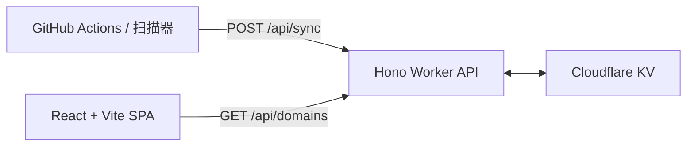

# DIGITX

DIGITX 用于发现和验证高价值纯数字域名候选，包括豹子号、顺子号、吉祥号和技术常量等。

项目采用 pnpm TypeScript monorepo，由 React 前端、Cloudflare KV 驱动的 Worker API，以及带 DNS/WHOIS 双通道校验的扫描器组成。

## 架构



- `packages/core`：类型安全的候选生成、DNS/WHOIS 检查和数据库工具。
- `apps/scanner`：本地交互式 CLI 与定时批量扫描器。
- `apps/api`：使用 Cloudflare KV 的 Hono Worker API。
- `apps/web`：基于 React、Vite、Tailwind 与 shadcn/ui 的前端。

## 前置条件

- Node.js 20+
- pnpm 10+
- 生产环境同步需要 Cloudflare KV 命名空间和 Worker 密钥

## 常用命令

```bash
pnpm install
pnpm check-types
pnpm build
```

启动本地交互扫描器：

```bash
pnpm cli
```

运行一次定时扫描批次并同步到 API。请先设置 `API_URL` 和 `SYNC_SECRET`：

```bash
pnpm scan
```

需要快速进行本地验收时，先启动本地 Worker，再运行独立的小数据集命令。它只生成 10 个候选，且每次最多执行 3 次 WHOIS 查询：

```bash
pnpm dev
pnpm scan:local
```

该命令使用已被 Git 忽略的 `domains_db.local.json`，不会影响常规扫描器的本地进度。

本地运行前端或 Worker：

```bash
pnpm dev:web
pnpm dev:api
```

`domains_db.json` 是被 Git 忽略的本地扫描检查点；Cloudflare KV 才是生产环境的唯一数据源。

## 使用安全

扫描器分为两步：并发 DNS 过滤，然后节流执行 WHOIS 验证。请保留默认 2000ms WHOIS 延时，避免触发限流或被注册局封禁 IP。

## 许可证

MIT
